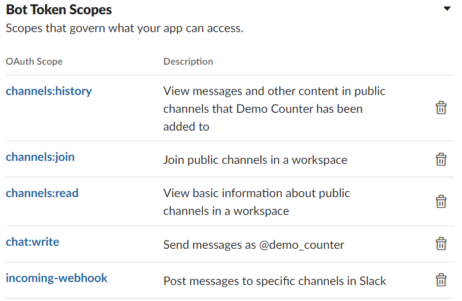

# Demo Counter

## Purpose

This program runs daily to count the number of demos that each EOS location has had and notify the #rht_demos channel about these numbers.

## Program Integrations

- [Slack Webhooks](https://api.slack.com/)

## Overview

Currently, the game will send a message to the rht_demos channel to notify if a 5 min demo is starting. This is the only way that we are able to track demos currently. So the way that we mine the demo data is scrape the channel with all of the demo messages and mine the information about what location that the demo occurred at.

## Slack

Currently the bot that performs this task needs permission to both read and write to channels. This is done via the slack API web portal. It is decently straightforward, but you just need to make sure that you have the correct scopes set or it will not be able to interface with the API as intended for this program. Below are the scopes I included to make it work. Some might not be necessary. It may be necessary to create a new incoming webhook token from this portal as well if you take over the account as I believe it was tied to my slack account.



## ```data.json```

This contains all the sensitive data required for this program.

#### Slack URLS
The webhooks I mentioned in the previous section can be found here. One for the #messaging_test, which I used mainly to test my messages without clogging channels that people use. And then of course the #rht_demos channel where we want to send actual messages when things are finalized.

#### IDs
This has both the channel and bot id. The channel is the id of the #rht_demos channel and tells the program to go look at this specific channel for messages.

The bot id is the id of the other bot that sends the information about the demos to that same channel. The program will only look at messages sent with that bot id a try to parse out the message, so if that id is incorrect, then it will not work.

#### Friendly Names

These values just change the location number into something that people recognize. You will have to add numbers/names of locations as locations get added for them to show up as a name and not just a number.

#### Secret

Finally the secret is the JWT token that is found on your slack API portal. This also might need to be changed if my account gets shut down.

## Recommendations

I **HIGHLY** recommend that we find another solution to scraping data off of a slack channel if we want to continue tracking this data. Sending demo data to some sore of database and then querying it for the analytics is what I would think off the top of my head. It obviously works now, but I feel like there is a better way to mine this data than sending it to a slack channel and scraping the text. There is just too much that can go wrong and feels janky.
